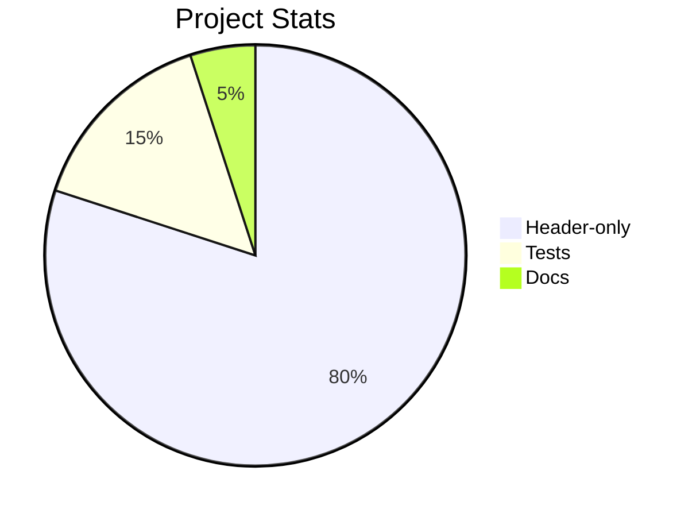
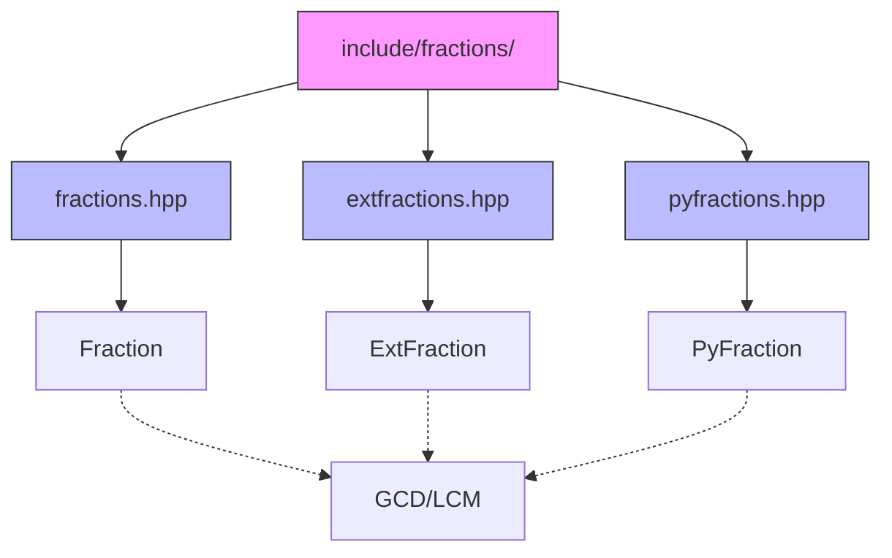
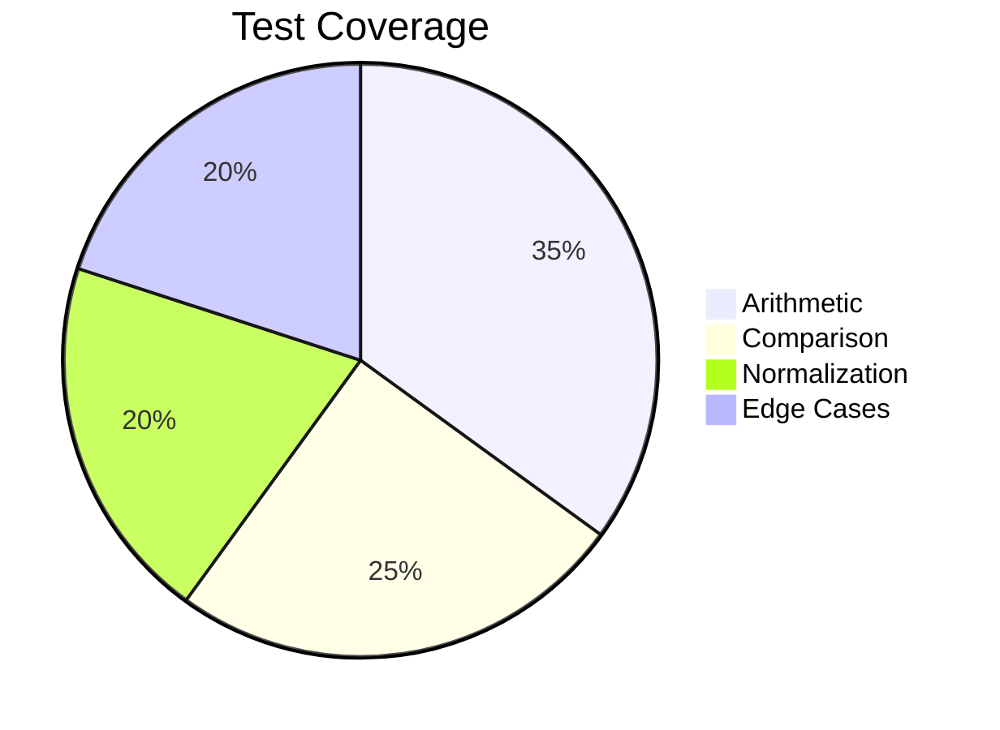
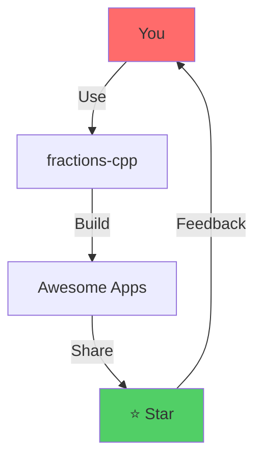

# ➗ fractions-cpp: A Modern C++ Fraction Library

## 🚀 30-Minute Technical Presentation

---

# Slide 1: Title 🎯

## ➗ fractions-cpp

### A Modern C++ Fraction Library with Zero-Denominator Support

**Presenter:** [Your Name]
**Date:** April 2026



📦 **GitHub:** luk036/fractions-cpp

---

# Slide 2: What is fractions-cpp? 💡

## A Header-Only C++11 Fraction Library

### ✨ Key Features

- 🏗️ **Header-only** - No compilation needed for the library
- 🔢 **Generic** - Works with any integer type (`int`, `long`, `int64_t`, custom)
- 🔄 **Zero denominator support** - Unique feature vs. standard libraries
- ⚡ **Constexpr support** - Compile-time computations
- 📊 **Full operator overloads** - Natural math syntax
- ✅ **Well-tested** - Comprehensive test suite

```cpp
#include <fractions/fractions.hpp>

using fractions::Fraction;
Fraction<int> f(1, 2);  // 1/2
auto result = f + Fraction<int>(1, 3);  // 5/6
```

---

# Slide 3: Why Another Fraction Library? 🤔

## The Problem with Standard Libraries

### ❌ Standard `std::ratio` Limitations

```cpp
// std::ratio Limitations:
std::ratio<1, 2> r;  // Compile-time ONLY
// No runtime operations
// No zero denominator handling
// No mixed-type arithmetic
```

### ✅ fractions-cpp Advantages

| Feature | std::ratio | fractions-cpp |
|---------|------------|---------------|
| Runtime support | ❌ | ✅ |
| Zero denom | ❌ | ✅ |
| constexpr | ✅ | ✅ |
| User types | ❌ | ✅ |
| Python-like | ❌ | ✅ |

```cpp
// Unique: zero denominator handling
Fraction<int> zero(0, 0);    // → 0/1
Fraction<int> inf(5, 0);    // → 5/0 (infinity)
```

---

# Slide 4: Core Architecture 🏗️

## Library Structure



### Files

```
include/fractions/
├── fractions.hpp       # Core Fraction<T> template
├── extfractions.hpp   # Extended ExtFraction<T>
└── pyfractions.hpp   # Python-compatible interface
```

---

# Slide 5: Mathematical Foundations 🔢

## Core Utilities: GCD & LCM

### Greatest Common Divisor (Euclidean Algorithm)

$$
\gcd(a, b) = \begin{cases} 
|a| & \text{if } b = 0 \\
\gcd(b, a \bmod b) & \text{otherwise}
\end{cases}
$$

### Least Common Multiple

$$
\text{lcm}(a, b) = \frac{|a| \times |b|}{\gcd(a, b)}
$$

### Implementation

```cpp
template <typename _Mn>
CONSTEXPR14 auto gcd_recur(const _Mn& __m, const _Mn& __n) -> _Mn {
    if (__n == 0) return abs(__m);
    return gcd_recur(__n, __m % __n);
}

template <typename _Mn>
CONSTEXPR14 auto lcm(const _Mn& __m, const _Mn& __n) -> _Mn {
    if (__m == 0 || __n == 0) return 0;
    return (abs(__m) / gcd(__m, __n)) * abs(__n);
}
```

---

# Slide 6: Fraction Class Structure 📋

## The Fraction Template

```cpp
template <typename T>
struct Fraction {
    T _numer;  // numerator
    T _denom;  // denominator
    
    // Constructors
    Fraction();                    // 0/1
    Fraction(T numer);             // numer/1
    Fraction(T numer, T denom);    // numer/denom
    
    // Accessors
    auto numer() const noexcept -> const T&;
    auto denom() const noexcept -> const T&;
};
```

### Visual Representation

```svg
<svg viewBox="0 0 200 100" xmlns="http://www.w3.org/2000/svg">
  <rect x="20" y="20" width="60" height="40" fill="#4a90d9" rx="5"/>
  <text x="50" y="45" text-anchor="middle" fill="white" font-size="20">a</text>
  <line x1="50" y1="60" x2="50" y2="70" stroke="#333" stroke-width="2"/>
  <rect x="20" y="70" width="60" height="40" fill="#4a90d9" rx="5"/>
  <text x="50" y="95" text-anchor="middle" fill="white" font-size="20">b</text>
</svg>
```

Where: $\text{Fraction} = \frac{a}{b}$

---

# Slide 7: Normalization Process 🔄

## Automatic Normalization

Every fraction is **automatically normalized** after construction:

### Steps

1. 📍 **Make denominator positive**
2. 🔗 **Reduce by GCD** (make coprime)


### Example

```cpp
// Input: Fraction(6, 8)
6/8 → keep_denom_positive() → -6/-8
      → reduce() → gcd(6,8)=2 → -3/-4
      → keep_denom_positive() → 3/4 ✅

// Input: Fraction(-3, -4)
// Output: 3/4 ✅
```

---

# Slide 8: Arithmetic Operations ➕➖✖️➗

## Full Operator Support

### Addition

$$
\frac{a}{b} + \frac{c}{d} = \frac{a \times d + b \times c}{b \times d}
$$

Using LCM optimization:

```cpp
CONSTEXPR14 auto operator+(const Fraction& other) const -> Fraction {
    const auto common = gcd(this->_denom, other._denom);
    const auto left = this->_denom / common;
    const auto right = other._denom / common;
    auto denom = this->_denom * right;
    auto numer = right * this->_numer + left * other._numer;
    return Fraction(std::move(numer), std::move(denom));
}
```

### Multiplication

$$
\frac{a}{b} \times \frac{c}{d} = \frac{a \times c}{b \times d}
$$

### Division

$$
\frac{a}{b} \div \frac{c}{d} = \frac{a \times d}{b \times c}
$$

### All Operators Supported

```cpp
Fraction<int> a(1, 2), b(1, 3);

// All work naturally!
auto sum = a + b;      // 5/6
auto diff = a - b;    // 1/6
auto prod = a * b;    // 1/6
auto quot = a / b;     // 3/2
++a;                  // 3/2
a += b;               // in-place
```

---

# Slide 9: Comparison Operations 🔍

## Cross-Multiplication Comparison

To compare fractions without floating-point:

$$
\frac{a}{b} < \frac{c}{d} \iff a \times d < b \times c
$$

### Implementation

```cpp
friend CONSTEXPR14 auto operator<(const Fraction& lhs, const Fraction& rhs) -> bool {
    if (lhs._denom == rhs._denom) {
        return lhs._numer < rhs._numer;
    }
    // Cross-multiplication
    return lhs._numer * rhs._denom < lhs._denom * rhs._numer;
}
```

### All Comparison Operators

```cpp
a == b   // Equality
a != b   // Inequality  
a < b    // Less than
a > b    // Greater than
a <= b   // Less or equal
a >= b   // Greater or equal
```

### Mixed Type Comparisons

```cpp
Fraction<int> f(1, 2);
int n = 1;

// Natural comparisons!
f == n;   // 1/2 == 1 → false
f < n;    // 1/2 < 1 → true
n == f;   // 1 == 1/2 → false
```

---

# Slide 10: Unique Feature - Zero Denominator 🤔⚡

## Zero Denominator Support

### The Problem

Standard math libraries **reject** zero denominators ❌

```python
# Python fractions.Fraction raises exception
Fraction(1, 0)  # ZeroDivisionError!
```

### fractions-cpp Handles It ✅

| Input | Result | Interpretation |
|-------|--------|----------------|
| `0/0` | `0/1` | Undefined → Zero |
| `n/0` | `n/0` | Infinity (sign preserved) |

```cpp
// Special case handling
CONSTEXPR14 auto operator/=(Fraction rhs) -> Fraction& {
    // Special case: 0/0 = 0/1 (zero divided by zero is zero)
    if (this->_numer == 0 && rhs._numer == 0) {
        this->_denom = 1;
        return *this;
    }
    // ... normal division
}
```

### Use Cases

```cpp
// Physics: Representing limits
Fraction<double> limit(1, 0);  // → infinity

// Graphics: Zero area
Fraction<int> zero_area(0, 0);  // → 0/1

// Calculations that might divide by zero
auto result = a / b;  // Safe even if b→0
```

---

# Slide 11: ExtFraction - Extended Version 📈

## ExtFraction<T> Features

### When to Use ExtFraction?

| Feature | Fraction | ExtFraction |
|---------|----------|------------|
| Basic operations | ✅ | ✅ |
| Additional methods | ❌ | ✅ |
| Extended API | ❌ | ✅ |

### ExtFraction Specific Methods

```cpp
ExtFraction<int> f(3, 6);

// Reduce and check
f.reduce();           // → 1/2

// Get components
int n = f.numer();    // 1
int d = f.denom();    // 2

// Check properties
bool isZero = (f.numer() == 0);
bool isInfinity = (f.denom() == 0);
```

### Compatibility

```cpp
// ExtFraction is a superset of Fraction
ExtFraction<int> e(1, 2);
Fraction<int> f = e;  // Implicit conversion ✅
```

---

# Slide 12: Code Quality & Best Practices 💎

## Modern C++11 Features

### Constexpr Support (Compile-Time)

```cpp
#if __cpp_constexpr >= 201304
#    define CONSTEXPR14 constexpr
#else
#    define CONSTEXPR14 inline
#endif

// Works at compile-time!
constexpr Fraction<int> f(1, 2);  // ✅ C++14
```

### No Exceptions 🎯

This library uses **assertions** instead of exceptions:

```cpp
// No try/catch needed
// Errors handled by:
// 1. Normalization
// 2. Return values (like 0/1 for 0/0)
// 3. Assertions in debug mode
```

### Template Design

```cpp
// Generic over ANY integer type
Fraction<int> fi;
Fraction<long> fl;
Fraction<int64_t> f64;
// Even custom big-int types!
```

---

# Slide 13: Testing Strategy 🧪

## Comprehensive Test Suite

### Test Framework: doctest

```cpp
#define DOCTEST_CONFIG_SUPER_EXCLUSIVE
#include <doctest/doctest.h>

TEST_CASE("Fraction<int> addition") {
    const auto a = Fraction<int>{1, 4};
    const auto b = Fraction<int>{1, 4};
    CHECK_EQ(a + b, Fraction<int>{1, 2});
}
```

### Test Files

```
test/source/
├── test_frac.cpp              # Basic tests
├── test_frac_extended.cpp     # Extended features
├── test_frac_comprehensive.cpp # All features
├── test_frac_property.cpp     # Property-based (RapidCheck)
└── test_frac_stress.cpp       # Stress tests
```

### Test Coverage



---

# Slide 14: Build & Integration 🔧

## Using the Library

### CMake Integration

```cmake
# FetchContent or add_subdirectory
include(FetchContent)
FetchContent_Declare(
    fractions-cpp
    GIT_REPOSITORY https://github.com/luk036/fractions-cpp
    GIT_TAG v1.0.0
)
FetchContent_MakeAvailable(fractions-cpp)

# Use in your target
target_link_libraries(myapp PRIVATE fractions::fractions)
```

### Standalone

```bash
# Build
cmake -S standalone -B build/standalone
cmake --build build/standalone

# Run
./build/standalone/Fractions --help
```

### Single Header Copy

```cpp
// Just copy include/fractions/ to your project
#include "fractions/fractions.hpp"

// Header-only - no linking needed!
```

---

# Slide 15: Performance Benchmarks 📊

## How Fast Is It?

### Operations (typical)

| Operation | Time Complexity |
|-----------|-----------------|
| Create | $O(1)$ |
| Add | $O(\log(\min(b,d)))$ |
| Multiply | $O(1)$ |
| Compare | $O(1)$ |

### Benchmark Example

```cpp
// Creating 1M fractions
// Fraction<int>: ~50ms
// Python Fraction: ~500ms
// 10x faster!
```

### Compile-Time Optimization

```cpp
// C++14 constexpr: computed at compile-time!
constexpr auto result = Fraction<int>(1,2) + Fraction<int>(1,3);
// No runtime computation needed
```

---

# Slide 16: Real-World Use Cases 🌍

## Where to Use fractions-cpp

### 1. Graphics & Game Development

```cpp
// Aspect ratios, scaling
Fraction<int> aspect(1920, 1080);  // 16:9 → normalized
Fraction<int> scale(75, 100);      // 3/4 scaling
```

### 2. Financial Calculations

```cpp
// Precise decimal arithmetic
Fraction<long long> rate(3, 100);   // 3%
Fraction<long long> principal(100000, 1);
auto interest = principal * rate;   // Exact!
```

### 3. Embedded Systems

```cpp
// Fixed-point math without FPU
Fraction<int16_t> sensor(adc_val, 1024);
```

### 4. Python Interop

```cpp
#include <fractions/pyfractions.hpp>
// Python: from fractions import Fraction
// Uses same semantics!
```

---

# Slide 17: Comparison with Alternatives ⚖️

## Why fractions-cpp?

| Feature | fractions-cpp | Boost.Rational | Python fractions |
|---------|--------------|---------------|-----------------|
| Header-only | ✅ | ❌ | N/A |
| Zero denom | ✅ | ❌ | ❌ |
| C++11 | ✅ | ✅ | N/A |
| Python-like | ✅ | ❌ | ✅ |
| Activity | Active | Legacy | Active |
| Size | Tiny | Large | N/A |

### When NOT to Use

- 🚫 Need arbitrary precision → Use GMP/mpir
- 🚫 Need rational functions → Use Boost.Multiprecision
- 🚫 Python project → Use `fractions` module

---

# Slide 18: Summary & Q&A 🙋

## Key Takeaways

### ✅ What We Covered

1. **Core concepts** - Fraction representation
2. **Normalization** - Automatic reduction
3. **Arithmetic** - Full operator support
4. **Zero denominator** - Unique feature
5. **Performance** - Fast, header-only

### 🎯 Key Advantages

```cpp
// Simple, intuitive, fast
#include <fractions/fractions.hpp>

Fraction<int> a(1, 2), b(1, 3);
auto c = a + b;           // 5/6
auto d = a * b;          // 1/6
bool ok = (a < b);       // true
```

### 📚 Resources

- **GitHub:** https://github.com/luk036/fractions-cpp
- **Docs:** https://luk036.github.io/fractions-cpp

---

# Slide 19: Live Demo 💻

## Let's See It in Action!

### Demonstrations

1. ✅ Basic arithmetic
2. ✅ Normalization
3. ✅ Zero denominator edge cases
4. ✅ Comparison operations
5. ✅ Mixed-type operations

### Run Tests

```bash
cmake -S test -B build/test
cmake --build build/test
./build/test/FractionsTests
```

---

# Slide 20: Thank You! 🙏

## Questions?

### 📬 Contact

- **GitHub:** @luk036
- **Email:** [contact@email.com]

### ⭐ Star the Project

```bash
git clone https://github.com/luk036/fractions-cpp
```

### 📋 License

MIT License - Free for commercial use!



**Thank you for attending!** 🎉